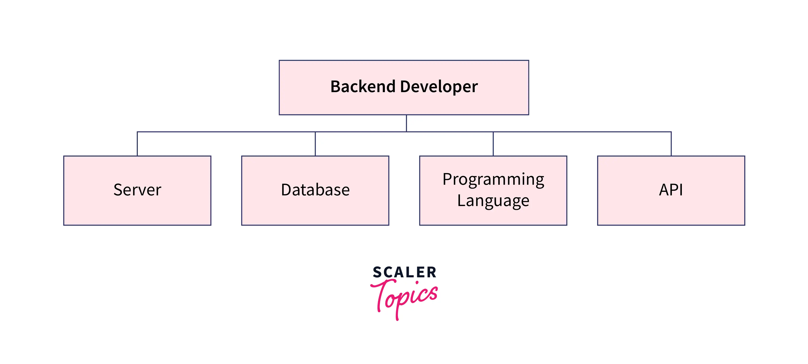

# Backend Development Lifecycle

The backend development lifecycle consists of several phases that guide a project from initial concept to deployment and maintenance. Each phase plays a critical role in creating reliable, efficient, and maintainable backend systems.

## 1. Requirements Gathering

This initial phase focuses on understanding what needs to be built.

### Key Activities
- **Client Consultation**: Understanding client needs and expectations
- **Business Analysis**: Identifying business processes and requirements
- **Stakeholder Interviews**: Gathering input from all relevant parties
- **Documentation**: Creating detailed requirements documents

### Deliverables
- Requirements documentation
- Initial project scope
- Stakeholder approval

## 2. System Requirements Specification (SRS)

This phase transforms business requirements into technical specifications.

### Key Activities
- **Functional Requirements**: What the system should do
- **Non-Functional Requirements**: How the system should perform
  - Performance expectations
  - Scalability requirements
  - Security needs
  - Reliability standards
- **User Stories**: Descriptions of features from user perspective
- **Use Cases**: Detailed scenarios of system interactions
- **Acceptance Criteria**: Conditions that must be met for acceptance

### Deliverables
- SRS document
- User stories and use cases
- System constraints list
- Technical feasibility assessment

## 3. Design Phase

The design phase outlines the technical implementation approach.

### Key Activities
- **Architecture Design**: High-level system structure
  - System components
  - Communication patterns
  - Integration points
- **Database Design**: Data models and relationships
  - Schema design
  - Entity relationships
  - Indexing strategy
- **API Design**: Endpoints, request/response formats
  - REST/GraphQL specifications
  - Authentication mechanisms
  - Rate limiting strategy
- **Security Design**: Authentication, authorization, data protection
- **UI/UX Design**: User interface and experience (if applicable)

### Deliverables
- Architecture diagrams
- Database schemas
- API documentation
- Security protocols
- Design approval

## 4. Development

The development phase involves writing the code that implements the design.

### Key Activities
- **Setup**: Development environment and tools
- **Implementation**: Writing code according to design
  - Backend services
  - Database implementation
  - API development
  - Integration with external systems
- **Code Review**: Peer review of code quality
- **Testing**: Unit, integration, and system testing
- **Documentation**: Code comments and technical documentation

### Deliverables
- Source code
- Unit tests
- Technical documentation
- Development build

## 5. Testing

The testing phase verifies that the system meets requirements and functions correctly.

### Key Activities
- **Unit Testing**: Testing individual components
- **Integration Testing**: Testing component interactions
- **System Testing**: Testing the complete system
- **Performance Testing**: Evaluating system performance
  - Load testing
  - Stress testing
  - Endurance testing
- **Security Testing**: Identifying vulnerabilities
  - Penetration testing
  - Code scanning
  - Dependency checks
- **User Acceptance Testing**: Validation by stakeholders

### Deliverables
- Test results and reports
- Performance benchmarks
- Security assessment
- Bug reports
- UAT sign-off

## 6. Deployment

The deployment phase moves the application to production.

### Key Activities
- **Environment Setup**: Preparing production environment
- **CI/CD Pipeline**: Automated build and deployment
  - Continuous integration
  - Automated testing
  - Deployment automation
- **Monitoring**: Setting up system monitoring
  - Performance monitoring
  - Error tracking
  - User analytics
- **Backup**: Implementing backup strategies
- **Documentation**: Deployment and operational guides

### Deliverables
- Production-ready application
- CI/CD pipeline
- Monitoring dashboard
- Operations documentation
- Deployment checklist

## 7. Maintenance

The maintenance phase keeps the system running and up-to-date.

### Key Activities
- **Bug Fixes**: Addressing issues in production
- **Updates**: Implementing new features
- **Performance Optimization**: Improving system efficiency
- **Security Patches**: Addressing vulnerabilities
- **User Support**: Providing assistance to users
- **Documentation Updates**: Keeping documentation current

### Deliverables
- Bug fix releases
- Feature updates
- Performance reports
- Security updates
- Support documentation

## Iterative Development

Modern backend development often follows iterative methodologies like Agile or DevOps, where these phases are repeated in smaller cycles, allowing for continuous improvement and adaptation to changing requirements.

### Agile Approach
- Shorter development cycles (sprints)
- Regular stakeholder feedback
- Continuous integration and delivery
- Adaptive planning

### DevOps Practices
- Automated testing and deployment
- Infrastructure as code
- Continuous monitoring
- Feedback loops

## Best Practices

- **Documentation**: Maintain comprehensive documentation throughout the lifecycle
- **Version Control**: Use Git or other version control systems
- **Automated Testing**: Implement comprehensive test suites
- **Code Quality**: Follow coding standards and best practices
- **Security First**: Consider security at every stage
- **Performance**: Monitor and optimize performance regularly
- **Scalability**: Design systems to scale with growing demands
