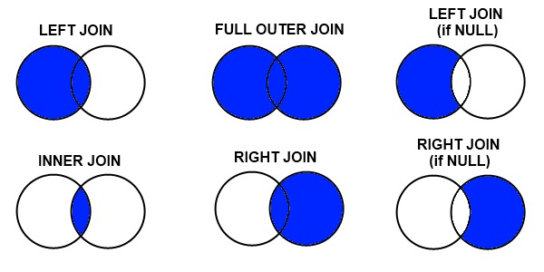

Sure! Here's the **Markdown version** of your updated DQL section with properly **linked images**, ready to drop into your README:

---

# Data Query Language (DQL)

DQL (Data Query Language) focuses on retrieving data from the database. While some consider DQL to be part of DML, it's often treated separately due to its non-modifying nature and extensive functionality. The primary command in DQL is SELECT.

---

## Basic SELECT Syntax

```sql
SELECT [DISTINCT] column1, column2, ... | *
FROM table_name
[WHERE condition]
[GROUP BY columns]
[HAVING group_condition]
[ORDER BY columns [ASC|DESC]]
[LIMIT offset, count];
```


---

## Column Selection

```sql
-- Select all columns
SELECT * FROM students;

-- Select specific columns
SELECT first_name, last_name, grade_level FROM students;

-- Select with alias
SELECT 
    first_name AS "First Name",
    last_name AS "Last Name",
    grade_level AS "Grade"
FROM students;

-- Select with calculated column
SELECT 
    first_name,
    last_name,
    YEAR(CURRENT_DATE) - YEAR(birth_date) AS age
FROM students;

-- Select distinct values
SELECT DISTINCT department FROM courses;
```


---

## Filtering Data with WHERE

```sql
-- Simple comparison
SELECT * FROM students WHERE grade_level = 10;

-- Multiple conditions
SELECT * FROM students 
WHERE grade_level = 10 AND enrollment_date >= '2022-01-01';

-- Range condition
SELECT * FROM students 
WHERE grade_level BETWEEN 9 AND 12;

-- List membership
SELECT * FROM courses 
WHERE department IN ('Mathematics', 'Science', 'English');

-- Pattern matching
SELECT * FROM students 
WHERE last_name LIKE 'S%';

-- NULL checks
SELECT * FROM students 
WHERE advisor_id IS NULL;

-- Complex conditions
SELECT * FROM assignments
WHERE (due_date < CURRENT_DATE AND submitted = FALSE)
   OR (grade IS NULL AND submitted = TRUE);
```

---

## Sorting Results with ORDER BY

```sql
-- Simple sort
SELECT * FROM students ORDER BY last_name;

-- Multiple sort columns
SELECT * FROM students ORDER BY grade_level DESC, last_name ASC;

-- Sort by column position
SELECT first_name, last_name, grade_level FROM students ORDER BY 3 DESC, 2;

-- Sort by expression
SELECT first_name, last_name, birth_date FROM students
ORDER BY EXTRACT(MONTH FROM birth_date), EXTRACT(DAY FROM birth_date);
```

---

## Aggregating Data with GROUP BY

```sql
-- Count by group
SELECT grade_level, COUNT(*) AS student_count
FROM students
GROUP BY grade_level;

-- Multiple aggregate functions
SELECT 
    department,
    COUNT(*) AS course_count,
    AVG(credits) AS avg_credits,
    MIN(start_date) AS earliest_course,
    MAX(start_date) AS latest_course
FROM courses
GROUP BY department;

-- Grouping by multiple columns
SELECT department, instructor_id, COUNT(*) AS course_count
FROM courses
GROUP BY department, instructor_id;

-- Filtering groups with HAVING
SELECT grade_level, AVG(grade_point_average) AS avg_gpa
FROM students
GROUP BY grade_level
HAVING AVG(grade_point_average) > 3.5;
```


---

## Joining Tables



```sql
-- Inner join (only matching rows)
SELECT 
    s.first_name,
    s.last_name,
    c.course_name
FROM students s
INNER JOIN enrollments e ON s.student_id = e.student_id
INNER JOIN courses c ON e.course_id = c.course_id;

-- Left join (all rows from left table)
SELECT 
    s.first_name,
    s.last_name,
    a.advisor_name
FROM students s
LEFT JOIN advisors a ON s.advisor_id = a.advisor_id;

-- Right join (all rows from right table)
SELECT 
    t.teacher_name,
    c.course_name
FROM courses c
RIGHT JOIN teachers t ON c.instructor_id = t.teacher_id;

-- Full outer join (all rows from both tables)
SELECT 
    s.student_id,
    s.first_name,
    e.enrollment_id
FROM students s
FULL OUTER JOIN enrollments e ON s.student_id = e.student_id;

-- Self join
SELECT 
    e1.employee_name AS employee,
    e2.employee_name AS manager
FROM employees e1
JOIN employees e2 ON e1.manager_id = e2.employee_id;

-- Cross join (Cartesian product)
SELECT s.student_id, c.course_id
FROM students s
CROSS JOIN courses c
WHERE s.grade_level = 12;
```


---

## Subqueries

```sql
-- Subquery in WHERE
SELECT course_name
FROM courses
WHERE course_id IN (
    SELECT course_id
    FROM enrollments
    WHERE student_id = 101
);

-- Subquery in SELECT
SELECT 
    student_id,
    first_name,
    last_name,
    (SELECT COUNT(*) FROM enrollments e WHERE e.student_id = s.student_id) AS course_count
FROM students s;

-- Subquery in FROM
SELECT dept_name, avg_credits
FROM (
    SELECT 
        department AS dept_name,
        AVG(credits) AS avg_credits
    FROM courses
    GROUP BY department
) AS dept_stats
WHERE avg_credits > 3;

-- Correlated subquery
SELECT 
    course_id,
    course_name
FROM courses c
WHERE credits > (
    SELECT AVG(credits)
    FROM courses
    WHERE department = c.department
);

-- EXISTS subquery
SELECT student_id, first_name, last_name
FROM students s
WHERE EXISTS (
    SELECT 1
    FROM enrollments
    WHERE student_id = s.student_id
    AND final_grade = 'A'
);
```

---

## Advanced Query Techniques

### Common Table Expressions (CTEs)

```sql
-- Basic CTE
WITH StudentGrades AS (
    SELECT 
        s.student_id,
        s.first_name,
        s.last_name,
        AVG(e.final_grade_point) AS avg_gpa
    FROM students s
    JOIN enrollments e ON s.student_id = e.student_id
    GROUP BY s.student_id, s.first_name, s.last_name
)
SELECT * FROM StudentGrades WHERE avg_gpa >= 3.5;
```


---

### Window Functions

```sql
-- Row number
SELECT 
    student_id,
    first_name,
    last_name,
    grade_level,
    ROW_NUMBER() OVER (PARTITION BY grade_level ORDER BY last_name) AS row_num
FROM students;
```


---

### UNION, INTERSECT, and EXCEPT

```sql
-- UNION (combine results, remove duplicates)
SELECT first_name, last_name FROM students
UNION
SELECT first_name, last_name FROM teachers;

-- INTERSECT
SELECT student_id FROM enrollments WHERE course_id = 101
INTERSECT
SELECT student_id FROM enrollments WHERE course_id = 102;

-- EXCEPT
SELECT student_id FROM students
EXCEPT
SELECT student_id FROM enrollments;
```

---

